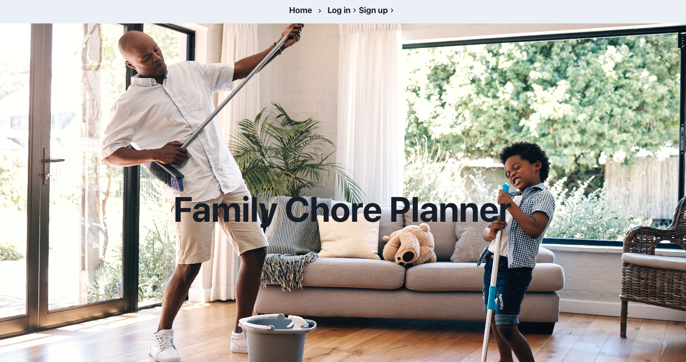

# Family-Chore-Planner

## Description

An app designed for modern families. Our full stack solution empowers parents and children alike to effortlessly manage household chores and earnings. Parents can easily create a secure profile, assigning unique logins and passwords. Once logged in, set personalized goals for your child to save towards.

### USER STORY

As a parent and child, I want to keep track of household chores and money earned for completing chores.

### ACCEPTANCE CRITERIA

- GIVEN a full stack program that accepts user input
- WHEN a parent creates a login and password
- THEN the program will create a profile to store child and the goal the child is saving for 
- WHEN a parent creates a chore
- THEN the parent will be able to assign the chore to a child and set a value for completion
- WHEN the user opens the application on a mobile screen
- THEN they are presented with a responsive UI
- WHEN the child visits their dashboard
- THEN they are able to see their progress and how much money they have earned

Through this program we learned how to make a full stack MERN program from scratch. We learned to pass data from our database in the back-end to the front-end, we learned how to create schemas, models, and resolvers. Our motivation for this project was to create an app to help bring financial literacy to children and make saving and financial goal setting fun.

## Table of Contents

- [Installation](#installation)
- [Usage](#usage)
- [Credits](#credits)
- [License](#license)

## Installation

What are the steps required to install your project? Provide a step-by-step description of how to get the development environment running.

To run the program visit the deployed link and follow the steps in Usage.

- Deployed Link: https://family-chore-planner.onrender.com 
- Github Repo Link: https://github.com/Four-Moons-Tech/Family-Chore-Planner 
- Group Presentation: https://docs.google.com/presentation/d/1kAvgxW8tFtcFGEIOU65Jz8uvckp_0eXMgx_-7183SiM/edit?usp=sharing 

## Usage

1. Visit the deployed site
2. Click Sign Up or Login button
3. Create a child user for your family
4. Assign chores to the children
5. View family profile to see all children in the family and their goals and current progress

Provide instructions and examples for use. Include screenshots as needed.

Screenshot:

## Credits

This is a group project with the following creators:

- Maryna Serdeshna: https://github.com/Marydesh 
- Anna Moon: https://github.com/Four-Moons-Tech 
- Anna Chuapetcharasopon: https://github.com/ahgeak 
- Bryan Chia: https://github.com/bryancz1493 

Our tutor Doug assisted us in this Project and helped overcome the challenge we had of displaying the data on the front end. 

https://preply.com/en/tutor/3316660

## License

This project uses an MIT license.

